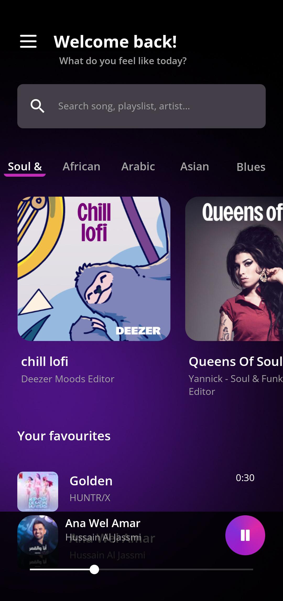
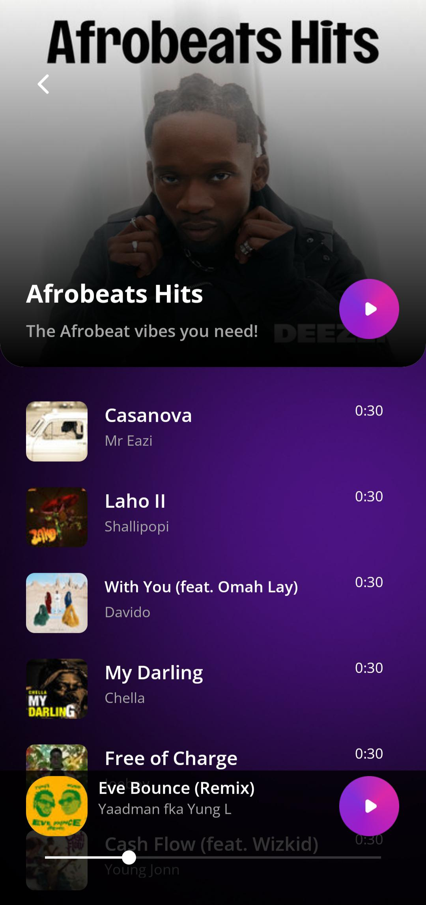
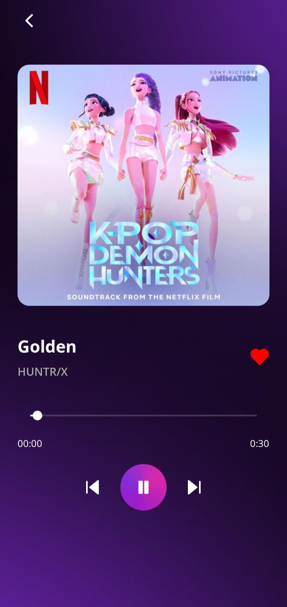

# 🎶 Beatify App

  
  
  

> **Beatify** is a modern music discovery app that lets you **discover, search, and play your favorite songs** — just like Spotify.  
Enjoy **smooth streaming**, a **clean UI**, and **personalized playlists** all in one place!  

---

## ✨ Features

- 🎧 **Discover New Music** – Explore curated playlists like *Afrobeats Hits*, *Chill Lofi*, and more.  
- 🔎 **Search Functionality** – Find any song, playlist, or artist quickly and easily.  
- ❤️ **Save Your Favourites** – Build your personal library with a single tap.  
- 🎵 **Smooth Playback** – Intuitive player with play/pause, skip, and progress tracking.  
- 🎨 **Beautiful Interface** – Sleek and minimal UI for a better listening experience.  

---

## 📸 Screenshots

| 🏠 Home Screen | 🎼 Playlist View | 🎧 Player Screen |
|---------------|----------------|----------------|
|  |  |  |

---

## 🚀 Tech Stack

| Tool | Purpose |
|------|---------|
| ⚛️ **React Native 0.79** | Cross-platform mobile app |
| 🛠 **Expo 53** | Development & build tooling |
| 🧭 **Expo Router** | Navigation between screens |
| 🗂 **Redux Toolkit** + **React Redux** | Global state management |
| 🔄 **React Query** | Server state caching & synchronization |
| 🌐 **Axios** | API requests |
| 🎨 **React Native Paper** | UI components |
| 🌀 **Moti** + **Reanimated 3** | Smooth animations |
| 📏 **Responsive Dimensions & Fontsize** | Responsive UI on all screens |
| ⚡ **FlashList (Shopify)** | High-performance list rendering |
| 🎵 **Expo Audio** | Music playback |
| ✨ **Expo Blur & Linear Gradient** | Beautiful visual effects |
| 🎯 **Lucide React Native** | Modern, consistent icons |

---
